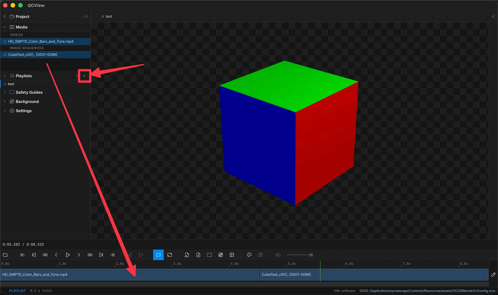

# Playlists

To create a playlist, right-click the **Playlists** bin in the Project panel → New Playlist.

To build a playlist, drag video or image-sequence sources from the Project panel into the timeline. Mixed video + image-sequence playlists work — QCView swaps backends at clip boundaries.

---

## Rearrange

Enter edit mode on the playlist track to drag clips into a new order. The currently-selected clip brightens noticeably and switches to a white border so it's easy to spot among other edit-mode clips.

---

## Per-clip trims

Per-clip in/out trims are honored across the playlist boundary — the next clip starts at its trim head on auto-advance.

---

## Playback

In addition to the usual transport controls, the transport bar shows **Prev clip** and **Next clip** buttons when a playlist is active. They jump the playhead to the start of the previous or next non-gap clip.

Prev's semantics: a mid-clip Prev press snaps to the current clip's startTime first; a second press (when you're at the current clip's start) jumps to the previous clip.

---

## Audio

Per-clip audio routing is preserved across the playlist. If a clip has multi-stream audio routed to specific output channels (5.1, language stems, etc.), that routing follows the clip as it plays. See the Audio routing controls in the Inspector.
