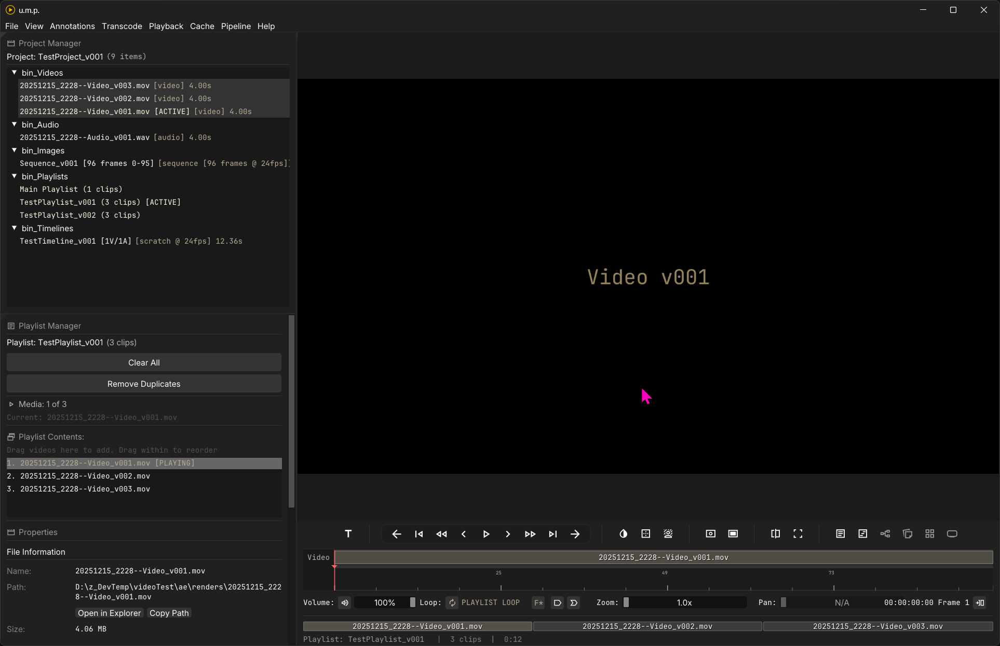
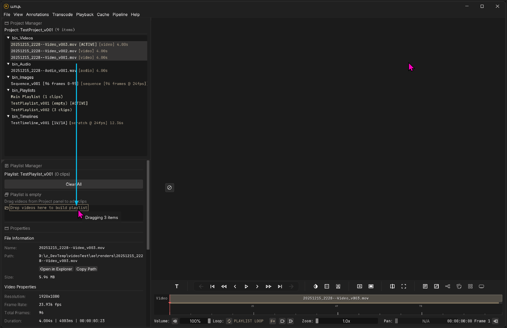
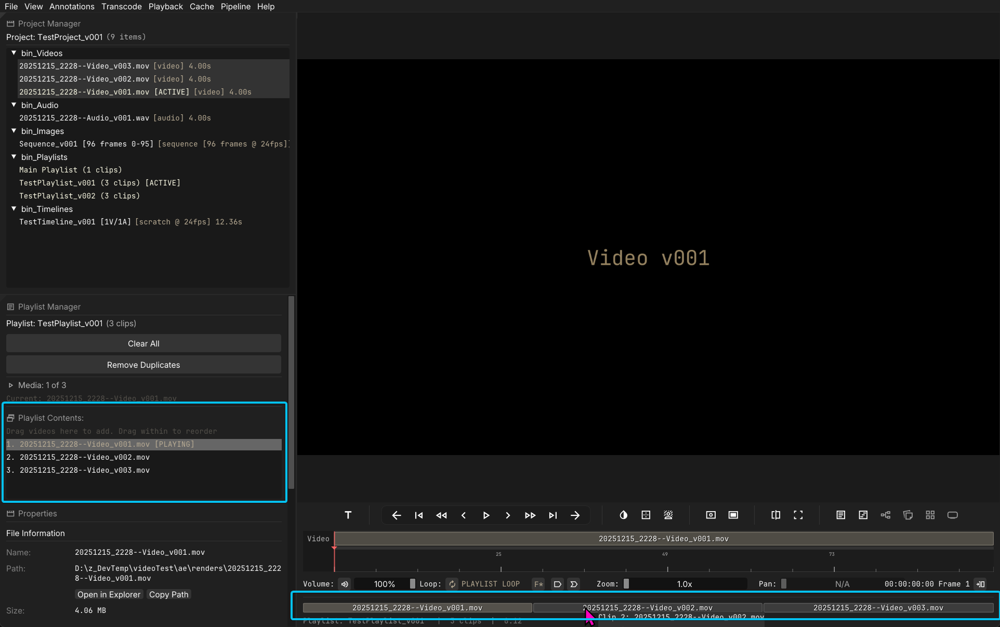
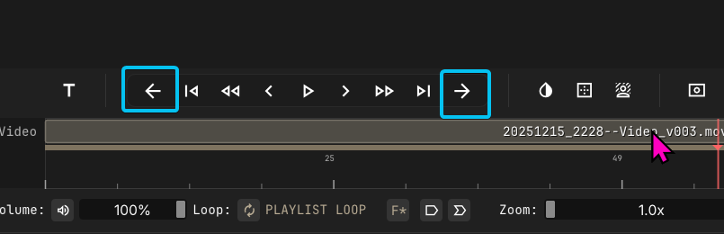

# Playlists

## Playlist Overview

Playlists only work for videos and use mpv’s built-in playlist function. Very simply: one video will play after another.

---

## Build a Playlist

To build a playlist, first double-click the playlist in the **Project Manager** to open it. Then select all the media you want and drag that media into the **Playlist Manager** in the **Inspector** panel. Or just right click on the media and select `Create Playlist from Selection`. You can keep dragging into more media as needed.

---

## Rearrange a Playlist

When a playlist is populated, you will see a list of all the clips in the Playlist Manager, as well as an array of the same at the bottom of the timeline. You can drag and drop them in both interfaces to rearrange.

---

## Playback

Playback controls are the same as other modes, but now these buttons are live. You can use them to navigate between playlist media. 

