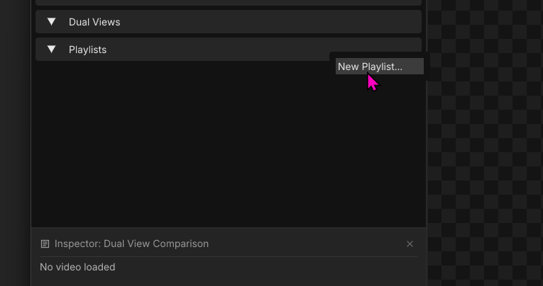
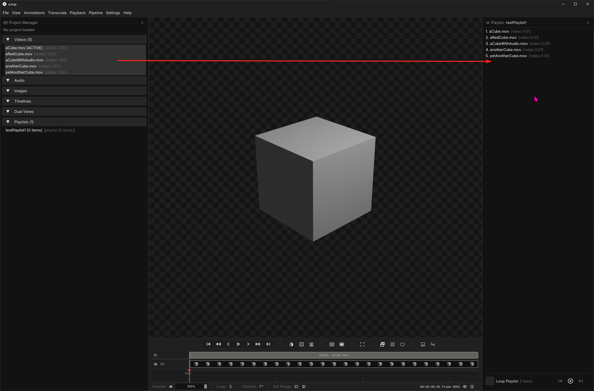
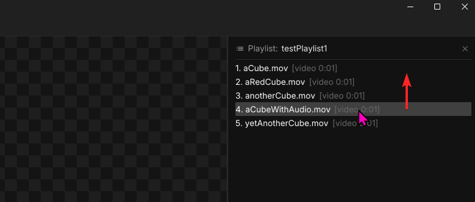
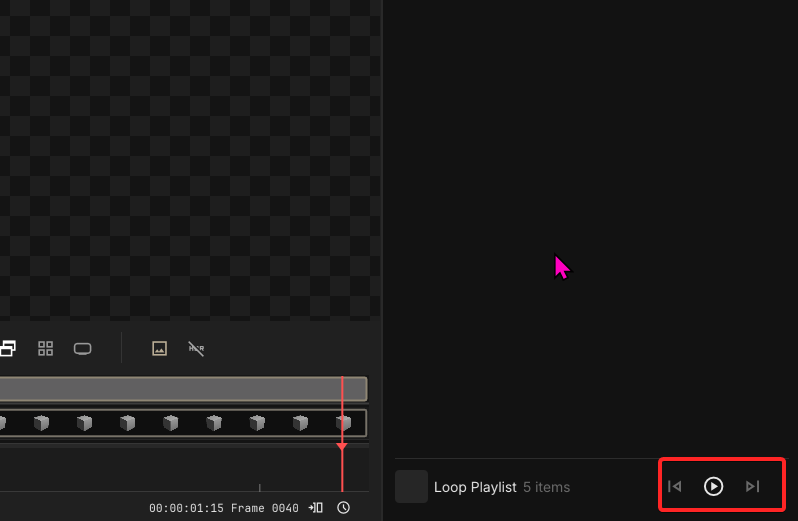

# Playlists

To create a playlist right-click on the playlist bin or navigate to `File > New Playlist`.

---

## Build a Playlist

To build a playlist, drag in any video or image sequence sources from the `Project Manager`.

---

## Rearrange a Playlist

Drag to rearrange clip order.

---

## Playback

Double-click on any clips in the playlist to start playing at that clip or click the playlist play button to start from the first clip. Toggle `Loop Playlist` to keep the playlist playing in a loop. Using the left/right shuttle buttons to skip to next clip or back up to the previous one.

