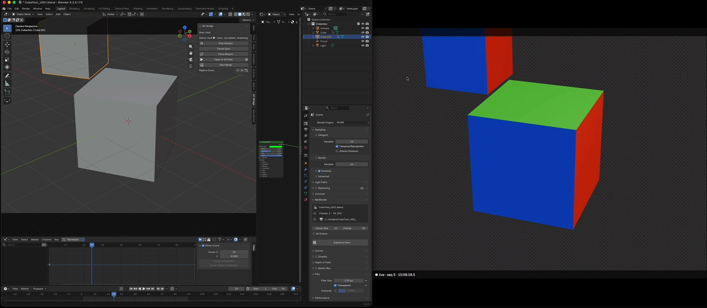
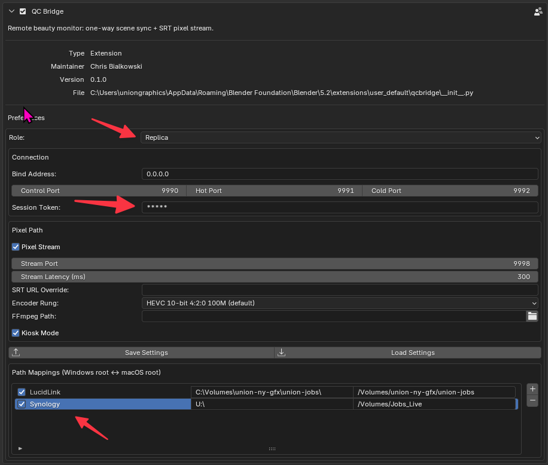
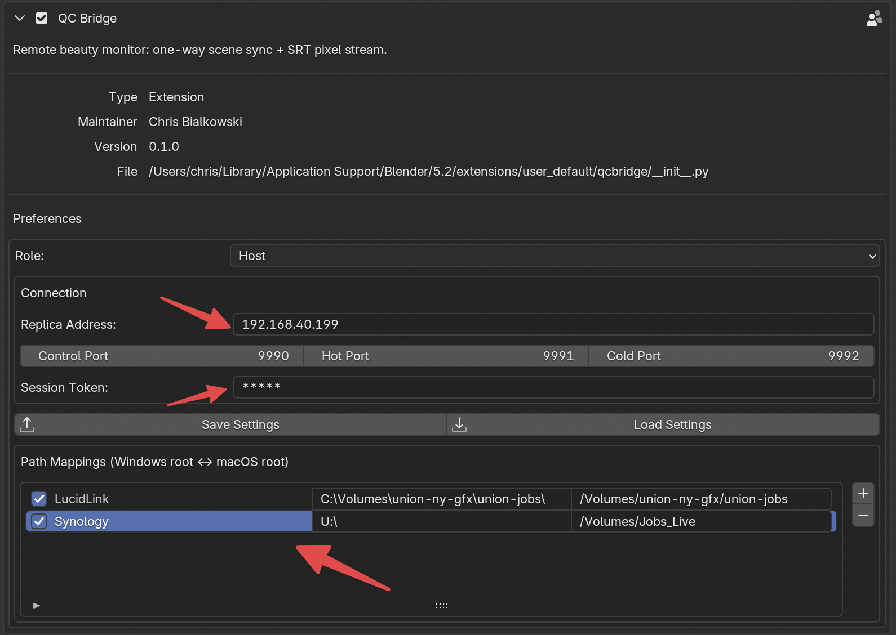
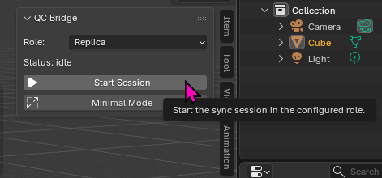
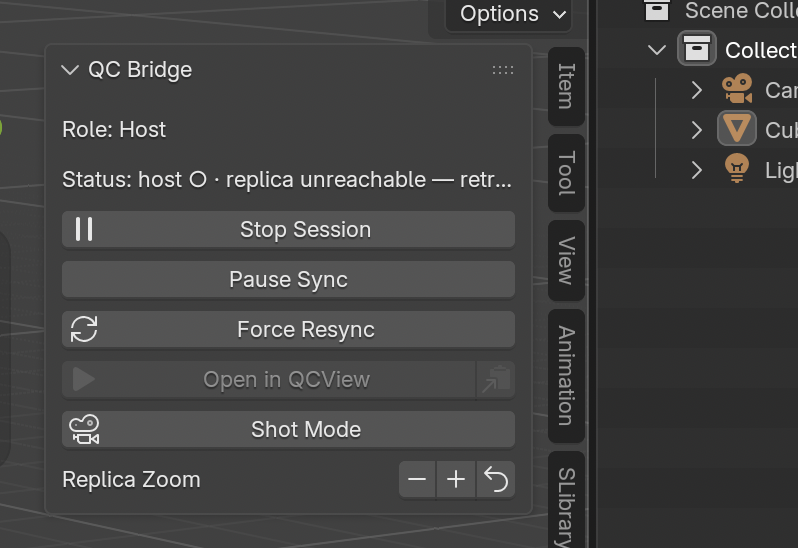

# QCBridge



[QCBridge](https://github.com/cbkow/QCBridge) is a Blender extension that gives you a remote "beauty window": you work in Blender on your own machine, while a second machine with a bigger GPU mirrors your scene, renders the full Cycles or Eevee preview, and streams it live into QCView. Your local Blender stays perfectly responsive; the remote render catches up to your edits in about a second.

It's one extension with two roles — **Host** (the machine you work on) and **Replica** (the render box) — connected over your LAN or VPN. Sync is strictly one-way: the replica never edits anything and never touches your project files.

> QCBridge is a working experiment, developed for production but tested mainly with a macOS host and a Windows replica. Expect rough edges.

---

## Requirements

- **Blender 4.5 or newer** on both machines (5.x is the working target).
- Both machines on the same network, or connected by a VPN (WireGuard-class works well).
- The project files reachable from both machines — typically shared network storage.
- For streaming into QCView: **QCView 2.2.4+** installed on the replica (it provides the ffmpeg that QCBridge uses to encode). Without it, set an ffmpeg path manually in the addon preferences — or skip streaming entirely and view the replica over Parsec/RDP instead.

---

## Installation

Download the extension zip from the [QCBridge releases](https://github.com/cbkow/QCBridge/releases) and install it on **both machines**: in Blender, go to **Edit → Preferences → Get Extensions**, click the dropdown arrow (top-right), choose **Install from Disk…**, and pick the zip. Or from a terminal:

```
blender --command extension install-file -r user_default -e qcbridge-0.1.0.zip
```

Updating later is the same step with a newer zip — your settings survive updates (they're also mirrored to a file that survives a full remove-and-reinstall).

---

## Setup

Open **Edit → Preferences → Add-ons → QC Bridge** on each machine.

**On the replica (the render box):**



1. Set **Role** to *Replica*.
2. Set **Bind Address** to the machine's LAN or VPN IP (or leave `0.0.0.0` to listen on all interfaces).
3. Choose a **Session Token** — any short phrase; both machines must use the same one. It also encrypts the stream.
4. Leave **Pixel Stream** on for QCView viewing (the encoder costs nothing until a viewer connects), or turn it off if you'll watch over remote desktop instead.
5. Leave **Kiosk Mode** on — the replica strips itself down to a clean fullscreen viewport when a session runs. (`Ctrl+Alt+K` toggles it manually; `Ctrl+Q` still quits Blender from inside it.)

**On the host (your workstation):**



1. Set **Role** to *Host*.
2. Set **Replica Address** to the replica's IP.
3. Enter the same **Session Token**.
4. If host and replica are different platforms sharing network storage, add **Path Mappings** — one row per storage root, e.g. `C:\Volumes\studio-nas\jobs` ↔ `/Volumes/studio-nas/jobs` — so file paths translate between them.

Windows note: the stream arrives over UDP. If QCView can't connect to the replica, allow the stream port through the replica's firewall (default 9998):

```
netsh advfirewall firewall add rule name="QCBridge SRT" dir=in action=allow protocol=UDP localport=9998
```

---

## Using it



Start Blender on both machines and press **Start Session** in the *QC Bridge* panel (sidebar of the 3D viewport, `N` key) — replica first, then host. The replica automatically loads whatever file the host has open and starts following: camera, timeline, lighting, materials, node edits, visibility — modeling changes take a moment longer. Opening a different project on the host? The replica follows that too. No further touching of the replica machine is needed; ending the session on the host drops the replica to an idle viewport, and the next session picks it back up.



From the host panel:

- **Open in QCView** — launches QCView on the live stream, named after your blend file. (Or **Copy Stream URL** for any other SRT-capable player.)
- **Shot Mode** — locks the replica to the camera frame: fitted to the stream, matted in black, holding steady while you orbit your scene freely. The timeline still follows. This framing matches your render output.
- **Replica Zoom −/+/reset** — punches the replica's camera view in or out without changing your own viewport.
- **Pause Sync** — holds your edits back (queued, not lost) while you try something messy; resume flushes them.
- **Force Resync** — resyncs the whole file if something is updating naturally (there is a lot that hasn't been tested yet).

The stream itself always tells you the truth: sync status, a sequence counter, and a clock are burned into the corner of the picture (`● live · seq 42 · 14:03:22.5`), so you can always tell live from stale — and measure your glass-to-glass latency against your own menu-bar clock.

## If something's off

The host panel names problems rather than hiding them: an unreachable or mistyped replica address, a token mismatch, a missing ffmpeg on the replica, or the replica's encoder state (`replica stream: streaming` / `restarting`). If QCView sits at "reconnecting" while the panel says the stream is running, it's almost always the replica's firewall (see the UDP rule above).
