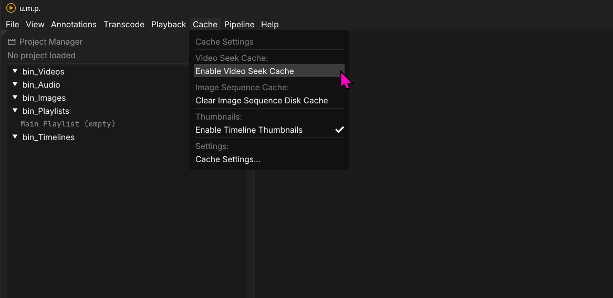

# Seek Cache

In Video mode, a highly threaded FFPMEG-based seek cache is available. This mode sidesteps mpv's video-decoding limitations for scrubbing by creating its own RAM-based cache for active scrubbing on high-resolution videos. There is a moderate performance hit and significant RAM usage when caching frames on 4k media, so this is not enabled by default, but provided as an option if you spend a lot of time reviewing renders and want to scrub through them as fast as possible. If you spend most of your day looking at ~1080p renders, this is useless on any modern computer.

