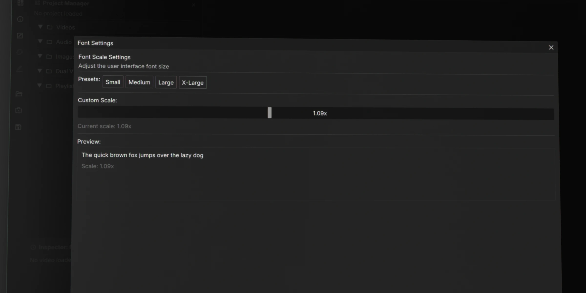

# Settings

## The Cache Panel

In QCview's **Settings** panel, you can adjust various settings to boost your system's performance.

### Image Sequences Cache

There is one setting you should immediately take a look at after installing the app:

- Under the `Image Sequence` tab, change your cache folder to a fast NVME disk with lots of space. If you plan on using the image-sequence transcoding options, this is where those transcodes will be stored. Some eviction settings will help manage how much data accumulates. 

---

## Font Settings

Drag the slider to adjust the font size scaling. This setting is persistent and will be remembered the next time you use the app.

> Note:
> `1.08x` is the setting I use personally for `125%` scaling in Windows.

