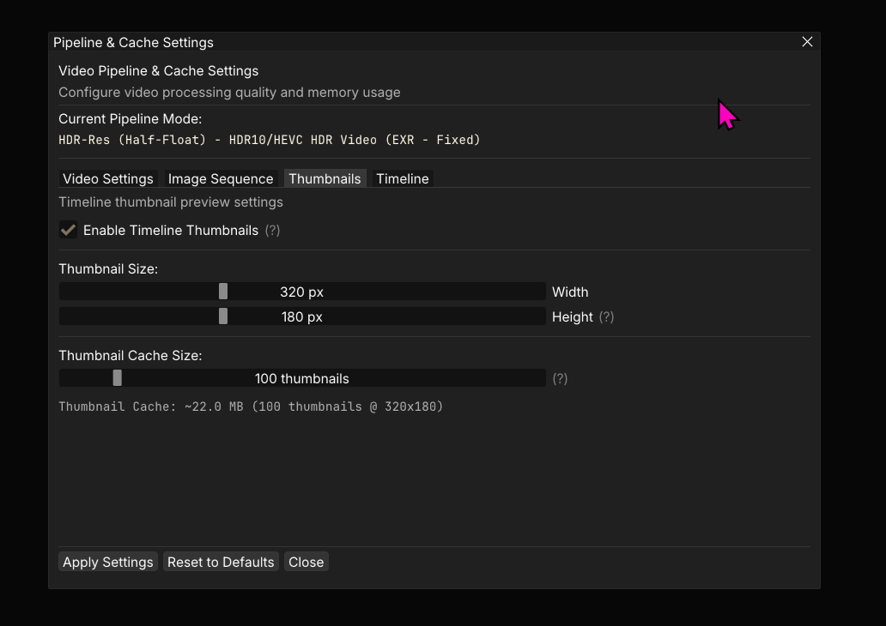
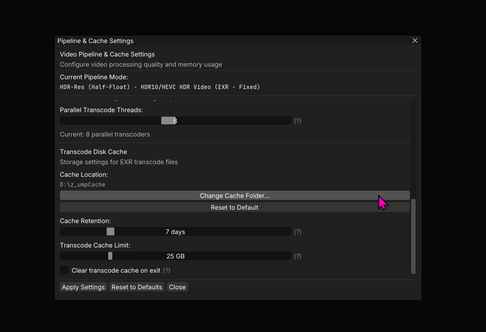
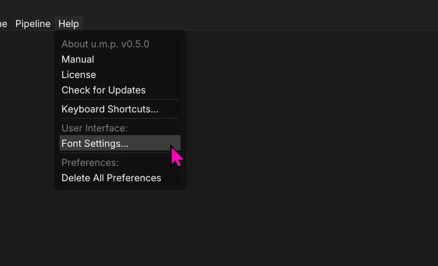
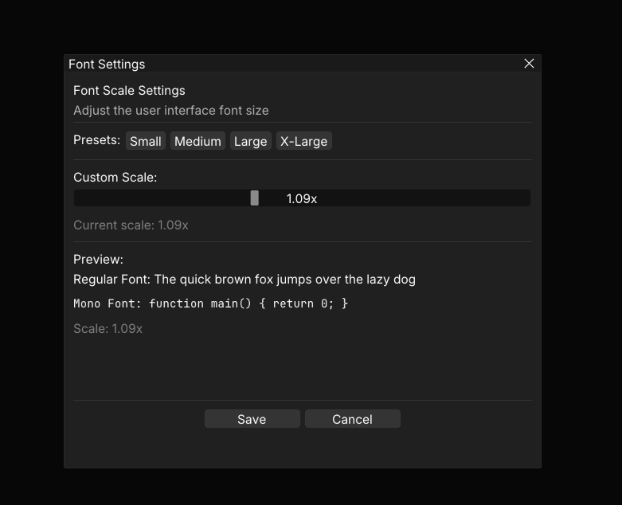

# Settings

## The Cache Panel

In u.m.p.'s **Pipeline & Cache Settings** panel, we have various settings that can help boost performance on your system. Each cache system has their own settings tab.

### Image Sequences Cache

There is one settings you should immediately take a look at after installing the app:

- Under the `Image Sequence` tab, change your cache folder to a fast NVME disk with lots of space. If you plan on using the image-sequence transcoding options, this is where those transcodes will be stored. Some eviction settings will help manage how much data accumulates. 

---

## Font Settings

You can scale the font size in this app to better accomidate your monitors resolution and DPI settings.

### Adjust Font Size

Drag the slider to adjust the font size scaling. This setting is persistent and will be remembered the next time you use the app.

