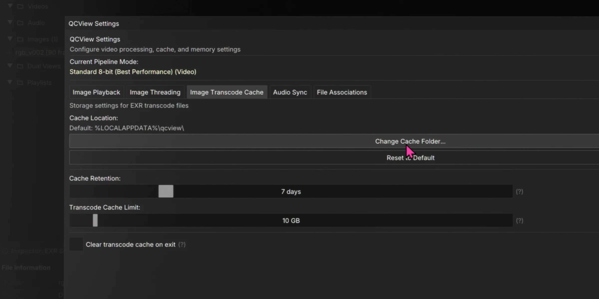
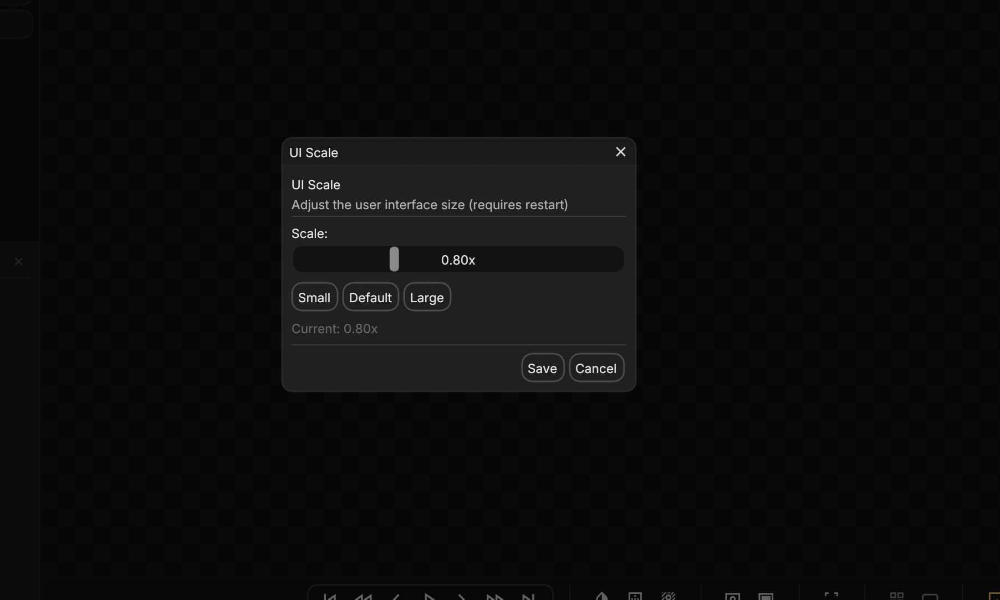

# Settings

## Image Sequence Cache

After installing QCView, the first setting worth configuring is the transcode cache location. Under the **Image Sequence** tab, point the cache folder to a fast NVMe drive with plenty of free space — this is where transcoded sequences will be stored. The eviction settings in the same panel control how aggressively old transcodes are cleaned up.

---

## UI Scale

Drag the slider to scale the entire interface — fonts, panels, spacing, and icons. This setting persists between sessions.

> `1.20x` is recommended for Windows systems running at 125% display scaling. On macOS, the default `1.0x` is most likely going to be too large for a retina screen.

