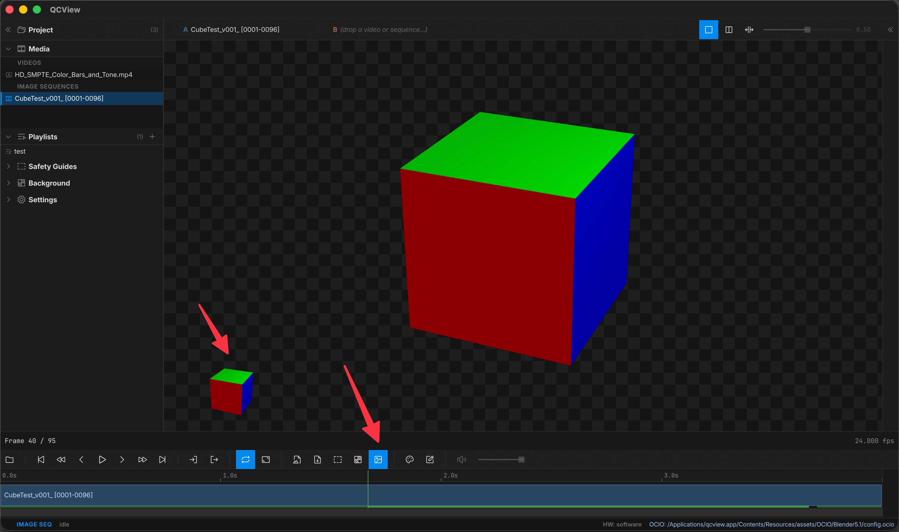

# Thumbnails

## Hover thumbnails

Hover the timeline to preview the frame in the corner of the viewport. Hover thumbs render through the same OCIO pipeline as the main viewport — what you see on hover matches what you'll see when you seek. These thumbnails generate faster than full frames, so they are helpful with large media or media with codecs that don't scrub well.

---

## Disabling thumbnails

Turn hover thumbnails off in Settings, or by clicking the toggle on the transport button row, if you prefer (focus mode, low-RAM systems). The clip filmstrip stays.
