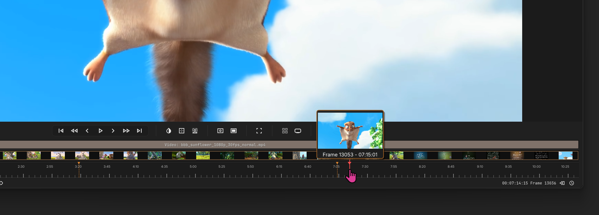
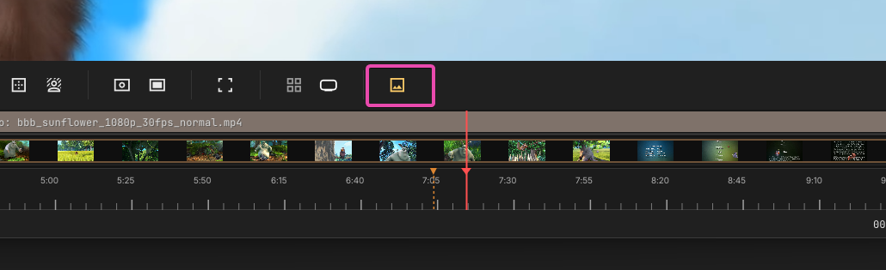

# Thumbnails

## Thumbnail window

Both videos and image sequences will generate thumbnails in the background on a low-priority thread. Thumbnails will populate the clip as markers. They will also be available, with more precision, when hovering over the timeline.

---

## Disabling Thumbnails

You can disable thumbnail generation in the Settings menu, or by using the `Thumbnails` toggle button.

