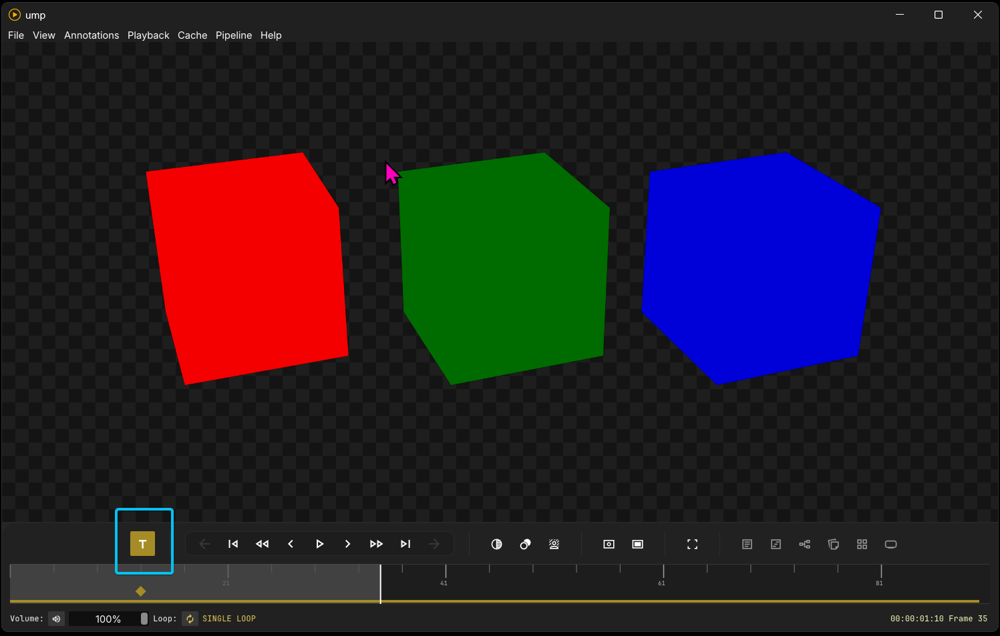
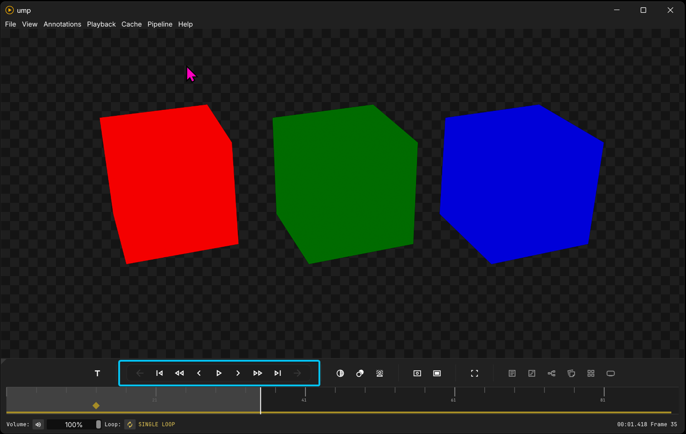
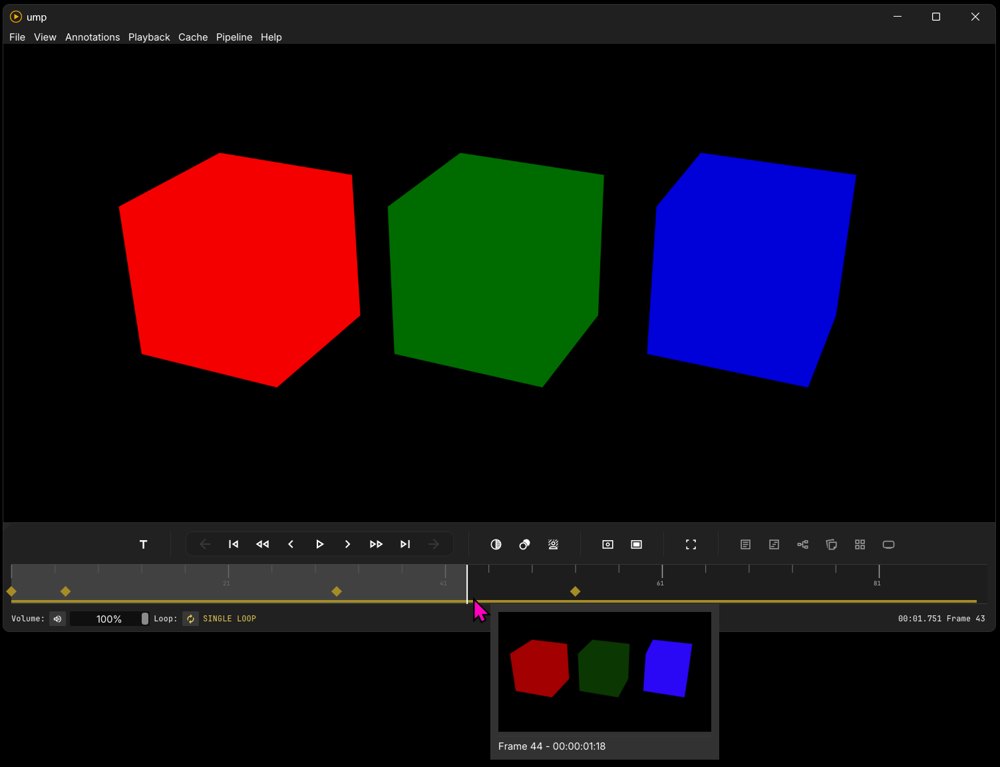
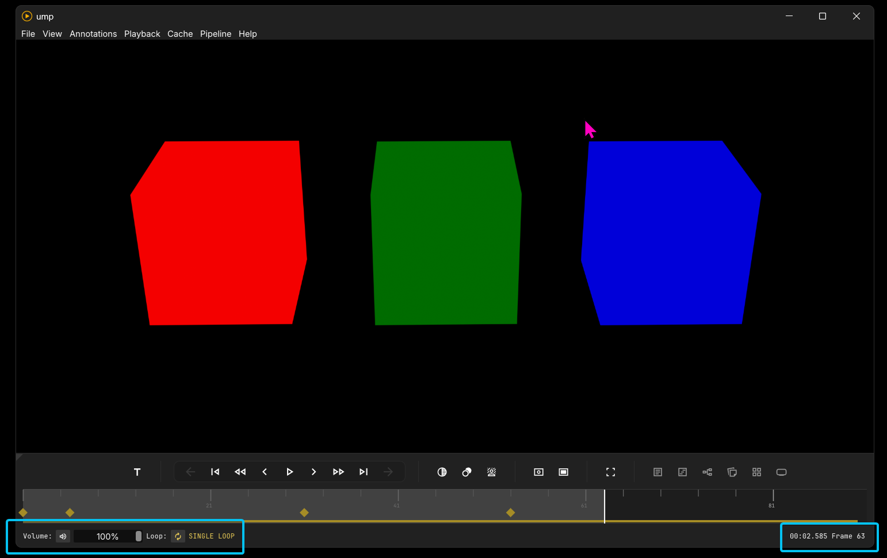

# Timeline and Transport Controls

The timeline and transport panel contains playback controls, annotation markers, a cache progress bar, time/frame counts, volume controls, and loop controls.

## Timecode mode

Timecode mode looks for QT start time or XMP timecode in video metadata and changes the time counter to match the timecode of the video.

---

## Transport controls

The transport controls are as follows:
- Previous video in playlist (only available in playlist mode)
- Beginning of media
- Rewind (press and hold--it will speed up over time)
- Back one frame
- Play/Pause
- Forward one frame
- Fast Forward (press and hold--it will speed up over time)
- End of media
- Next video in playlist (only available in playlist mode)

---

## The Timeline

### Video mode
In video mode there is a colored cache bar at the bottom of the timeline. This represents a fast-seek cache. Most useful for shorter videos, this cache has stored all the marked frames in memory for fast timeline scrubbing and seeking. It only runs when the video is paused--preventing playback interference. Fask scrubbing the timeline will quickly shuttle these frames stored in memory for precise seeks.

### Image sequence mode

When an image sequence is loaded into the viewport, this colored cache serves a different purpose--it shows frames cached for playback. Since some image sequences are huge files with massive i/o and decompression requirements, this is a relatively small cache that follows the playhead and keeps the immediate frames in memory. Scrubbing the timeline will not shuttle frames, but frames will instantly generate when the seekbar is released.

### Both modes

In both modes, we have an additional floating thumbnail viewer that loads when hovered over the timeline. On media loading, this thumbnail viewer instantaneously caches 25 evenly distributed frames to memory. As you hover over uncached parts of the timeline, it will regenerate missing frames--providing a seamless overview of frame content. These thumbnails are low resolution and supplied as a fast-seek tool. Depending on the format decoder, they will look low resolution, and will not be affected by our OCIO color correct pipeline. They can be disabled in the `View` menu.

Additionally, in both modes, there are diamond shapes that mark notes in our annotation window. See the annotation page for more details.

---

## Mute, Volume, Loop, and Frame count

At the bottom of our panel, on the left, we have a Volume bar, a Mute state button, and a Loop state button. On the right, we see the current time and frame of the playhead.