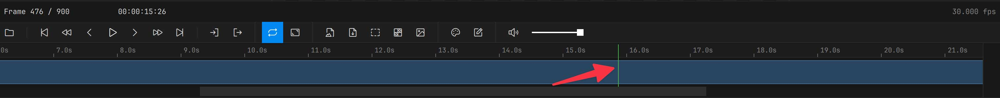
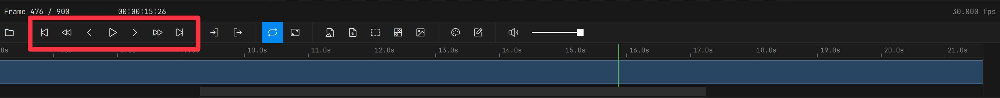
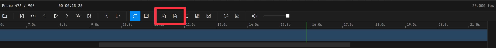
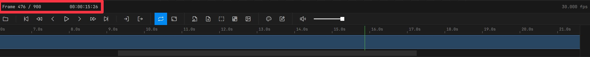
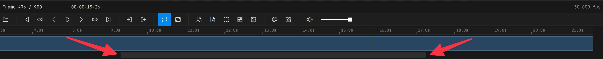
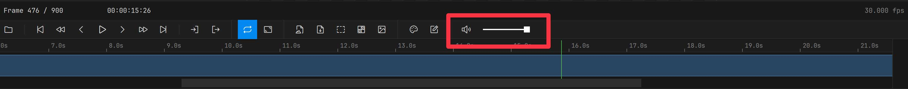
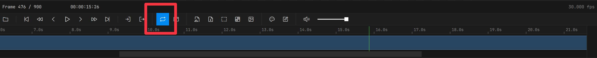
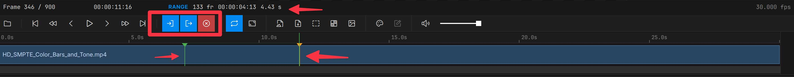
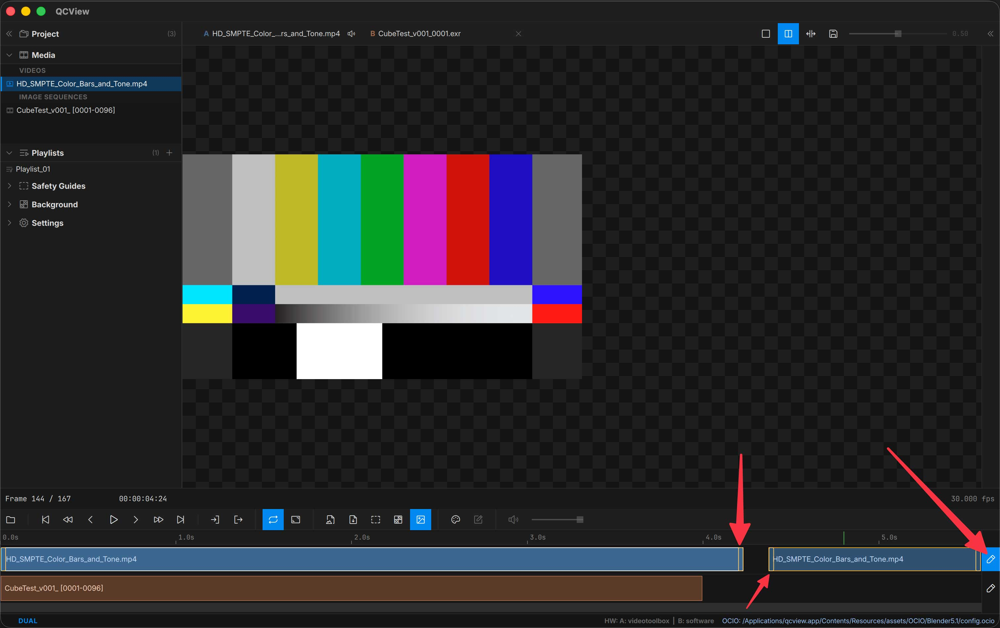
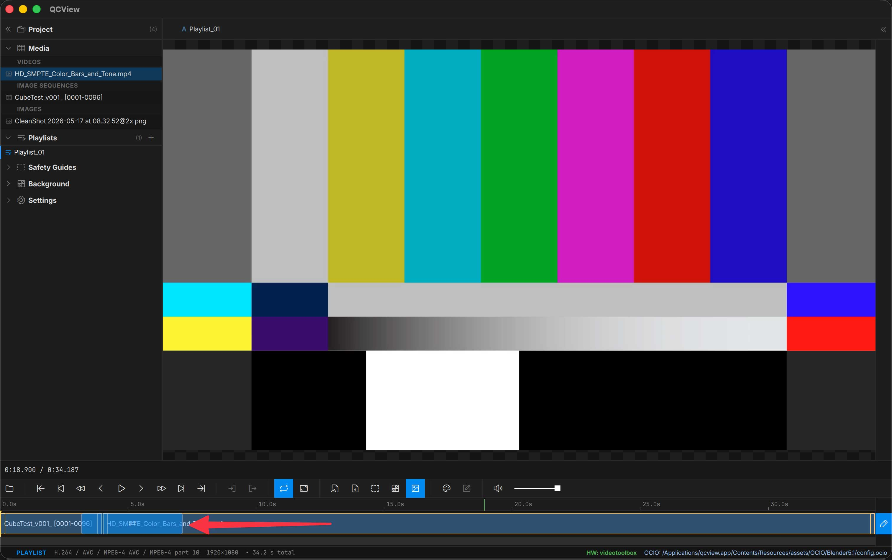

# Timeline and Transport Controls

The bottom of the viewport contains playback controls and timeline navigation. The layout adapts based on the type of media loaded and whether you're in playlist or single-source mode. Click on the video track to seek to a location or drag the playhead to scrub.

## Transport

| Button | Action | macOS | Windows |
|---|---|---|---|
| Beginning | Jump to start of media | `Home` (or `Fn + ←`) | `Home` |
| Rewind | Press and hold — accelerates over time | `A` / `J` (hold) | `A` / `J` (hold) |
| Back one frame | Step back one frame | `Q` | `Q` |
| Play / Pause | Toggle playback | `Space` / `K` / `W` / `S` | `Space` / `K` / `W` / `S` |
| Forward one frame | Step forward one frame | `E` | `E` |
| Fast-forward | Press and hold — accelerates over time | `D` / `L` (hold) | `D` / `L` (hold) |
| End | Jump to end of media | `End` (or `Fn + →`) | `End` |

In **playlist mode**, additional **Prev clip** / **Next clip** buttons appear. They jump the playhead to the start of the previous or next clip in the playlist. Prev snaps to the current clip's start first (mid-clip); a second press jumps to the previous clip.

---

## Screenshots

Two screenshot buttons capture the current viewport contents (with OCIO transforms applied):

| Button | Action | macOS | Windows |
|---|---|---|---|
| Clipboard | Copies the screenshot to the system clipboard | `⌘ + T` | `Ctrl + T` |
| Desktop | Saves a screenshot file to your Desktop | `T` | `T` |

---

## Timecode and Frames

The top-left corner displays the current timecode and frame count. 

For video files with embedded timecode, that timecode will be used. The Inspector's **Timecode Origin** pill lets you pick which timecode track to follow per-source. See the Inspector page for more info.

---

## Zoom and Pan

| Action | macOS | Windows |
|---|---|---|
| Zoom in / out on the timeline | `Wheel` | `Wheel` |
| Pan the timeline | `⌘ + Wheel` | `Ctrl + Wheel` |

You can also drag the edges of the overview-bar zoom indicator to adjust the visible range, or grab the indicator's body to scroll. Long-form content (feature films) can be zoomed all the way out to show the entire timeline or zoomed into a tighter view.

---

## Volume

Adjust the volume slider or click the speaker icon to toggle mute.

| Control | Action | macOS | Windows |
|---|---|---|---|
| Slider | Adjust playback volume | `↑` / `↓` | `↑` / `↓` |
| Speaker | Toggle mute | `M` | `M` |

---

## Looping

Loop mode is on by default — media restarts after reaching the end. Disable it to stop at the last frame.

| Button | Action | macOS | Windows |
|---|---|---|---|
| Loop | Toggle loop mode | `V` / `⌘ + L` | `V` / `Ctrl + L` |

### In/Out Range

Set a loop range with the **In** and **Out** buttons. A highlighted loop zone appears on the timeline. Press **Clear** to remove the range and play the full clip.

| Button | Action | macOS | Windows |
|---|---|---|---|
| In | Set loop in point at the current frame | `I` | `I` |
| Out | Set loop out point at the current frame | `O` | `O` |
| Clear | Remove the in/out range | `⇧ + I` | `Shift + I` |

In/out range is disabled in playlist mode — the buttons grey out and the timeline markers hide.

---

## Editing

In Dual View and Playlist modes, you can toggle edit mode for a track by clicking the pencil icon on the far right. In edit mode, grab the edges of a clip to trim. `Ctrl/Cmd + k` will cut at the playhead location. `Del` will delete the current selection.

In Playlist mode, you can select a clip and drag it to a new location in the timeline to rearrange clip order.

