# Timeline and Transport Controls

## The Controls

The bottom of the **Viewport** panel contains controls for media playback and app state shortcuts. The layout dynamically shifts based on the loaded media.

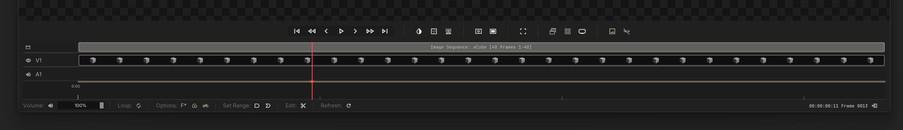

---

## Transport Controls

Media navigation is controlled with these buttons:

* Beginning of media
* Rewind (press and hold–it will speed up over time)
* Back one frame
* Play/Pause
* Forward one frame
* Fast Forward (press and hold–it will speed up over time)
* End of media

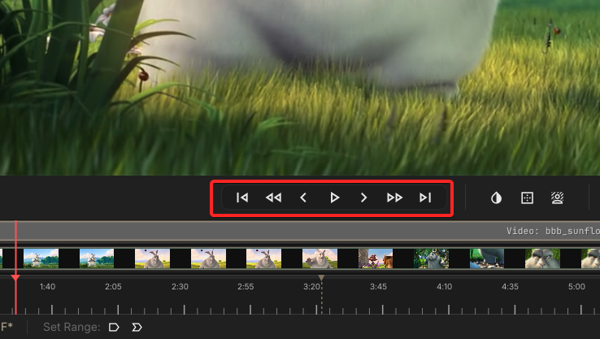

---

## Screenshots

These two buttons allow you to take screenshots of the **Viewer**. The first saves the screenshot to the Windows clipboard so you can paste it into other apps. The second saves a screenshot to your Desktop.

---

## Timecode and Frames

In the bottom-right corner of u.m.p., timecode and frame counts are displayed for loaded media. 

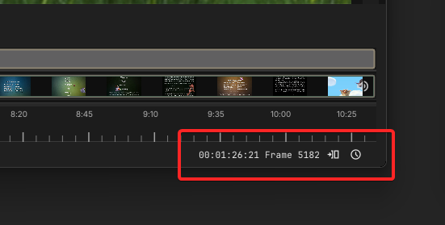

Immediately to the right of the timecode and frame count is a button that lets you seek to a specific time or frame.

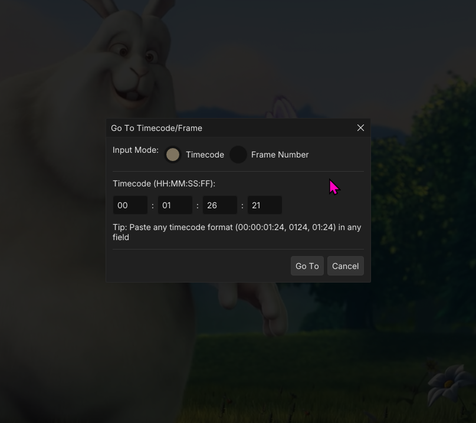

When you are watching a video, an additional button will appear in the far right that lets you switch to the embedded timecode if it's available. 

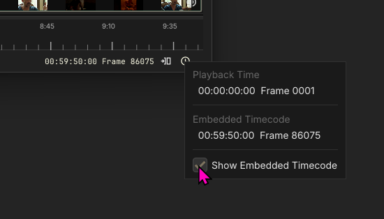

---

## Zoom/Pan the Timeline

You can zoom in on a tighter framing of the timeline visual using `Mouse Scroll`. If you `Ctrl + Mouse Scroll` this area, you can pan it. Sliding or dragging the edges of this zoom level visual also manipulates the timeline.

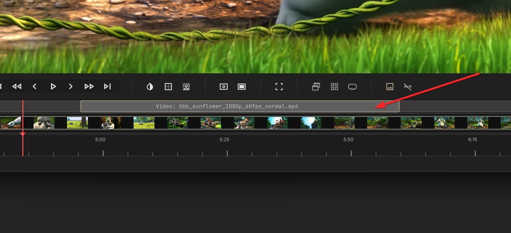

A `Middle Mouse Click` on the timeline itself lets you grab it and reposition it.

---

## Volume

In the bottom-left u.m.p., you can adjust the volume or toggle mute.

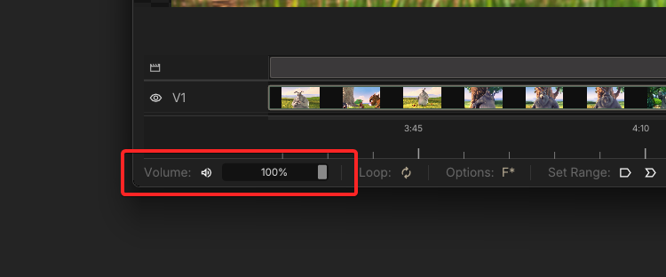

---

## Looping

Loop mode is toggled by default. The loaded media will loop to start and play again after reaching the end. Untoggling loop mode will stop the media at its end.

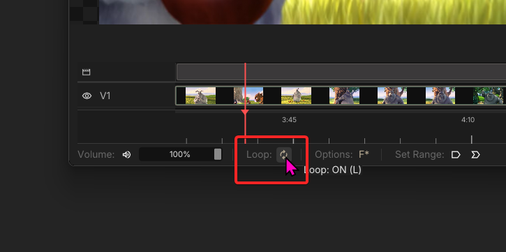

The keyboard command `I` and `O`, as well as the two buttons in `Set Range`, will toggle In and Out points on your timeline. Once an Out point is toggled, a Loop Zone will appear. This visual signifies a set range within which the media will play. Pressing `Clear` releases the Loop Zone and lets you play the entire clip again. 

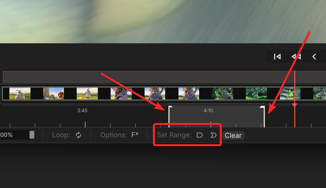

---

## Follow Playhead

If `Follow Playhead` is toggled, and the timeline is zoomed in, the timeline will shift every time the playhead is about to leave the view. This keeps the playhead on screen at all times.

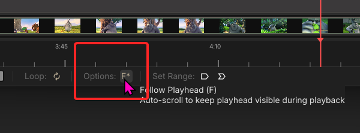 

---

## Adaptive Speed

The `Adaptive Speed` toggle appears when viewing an image sequence and is enabled by default. If playback can't keep up with decoding, fps will throttle in increments to keep the playhead from overrunning the image buffer.

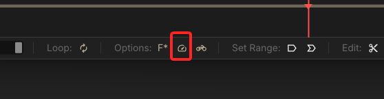

---

## Buffer Wait

In image sequences and timelines, 'Buffer Wait' appears. This toggle pauses the playhead when play is triggered, allowing the image buffer to fill to a specific duration. The default value is 2 frames, but you can right-click the toggle to select other values.

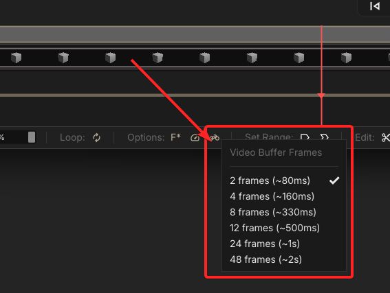

---

## Refesh Buffer

The 'Refresh' button appears in image sequences and timelines. It allows you to regenerate your image cache and refill the buffer.

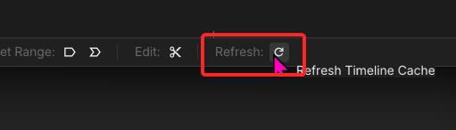
