# Timeline and Transport Controls

The bottom of the **Viewport** panel contains controls for media playback and app state shortcuts. It dynamically shifts based on the loaded media and presents appropriate options. 

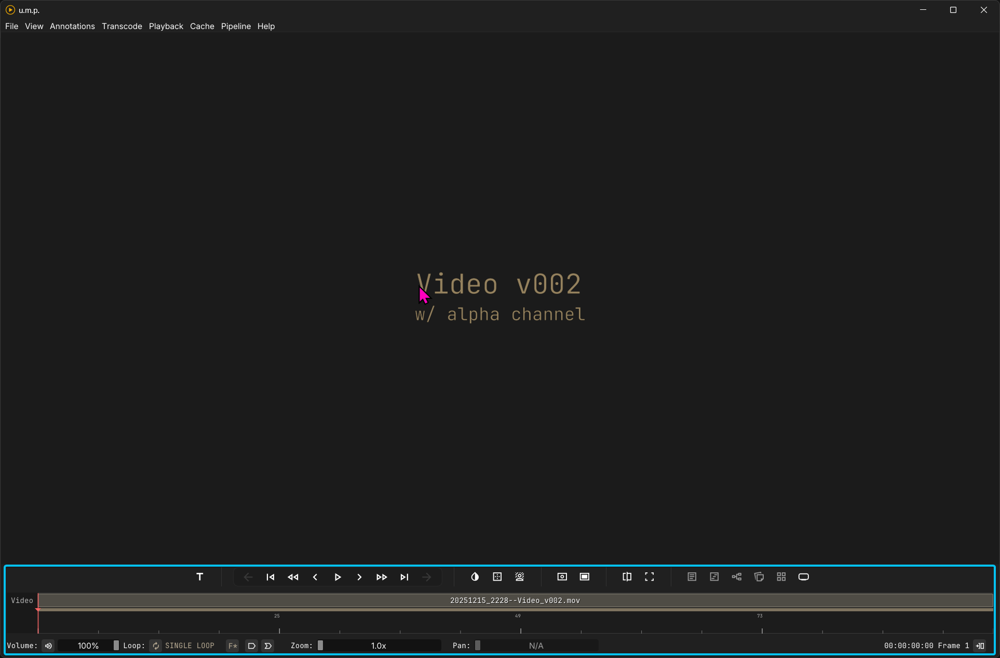

## Transport Controls

Timecode mode looks for QT start time or XMP timecode in video metadata and changes the time counter to match the timecode of the video.

### Transport Controls

Media navigation is controlled with these buttons:

* Previous video in playlist (only available in playlist mode)
* Beginning of media
* Rewind (press and hold–it will speed up over time)
* Back one frame
* Play/Pause
* Forward one frame
* Fast Forward (press and hold–it will speed up over time)
* End of media
* Next video in playlist (only available in playlist mode)

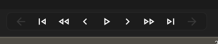

---

### Overlays

These three buttons toggle overlay selectors:

* Colorspace Presets
* Safety Guide Overlays
* Background colors/patterns.

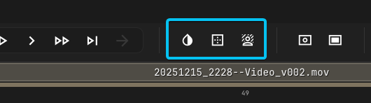

#### Color Presets

Color Presets trigger OCIO node trees for commonly accessed color correction flows. Click any to activate the flow, and click `Remove All Color Profiles` to remove any preset applied.

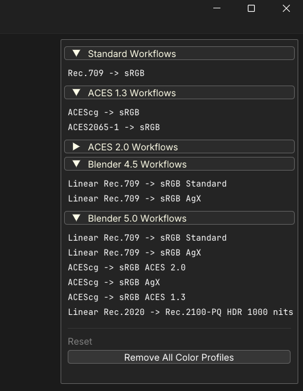

#### Safety Overlays

The **Safety Overlays** panel triggers title safety overlays in accordance with common broadcast and social media standards. You can control opacity, line thickness, and color. The app will remember your preferences for these variables. 

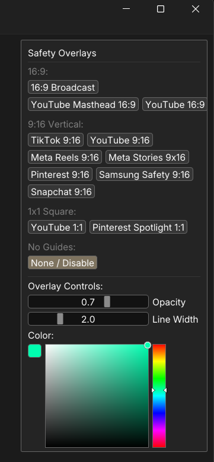

#### Background

This panel allows you to change the **Viewer’s** background color and pattern. This background will be presented behind the media, with alpha channels, as well as in the **Viewer's** periphery.

Options are:

* A plain black background
* A default sold grey background
* A dark variation of the mpv-style checkerboard background
* A recreation of the default light-themed mpv checkerboard background

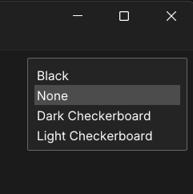

#### 

---

### Screenshots

These two buttons allow you to take screenshots of the **Viewer**. The first saves the screenshot to the Windows clipboard so you can paste it into other apps. The second saves a screenshot to your Desktop.

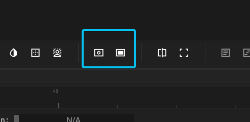

---

### Panel Toggles

The buttons toggle commonly used app panels including:

- The Inspector
- The Project Manager
- The OCIO color panels
- Annotations / Notes
- Miminal mode (just the viewport and timeline)

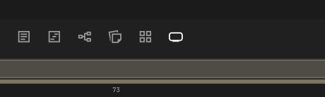

---

### Timecode mode

The Timecode mode button is a toggle state that searches the loaded media for embedded timecode.

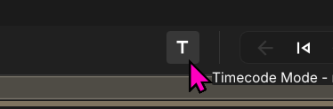

If the loaded media item has embedded timecode, our timecode readout will adjust to display it. 

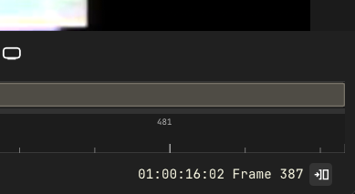

If you click on the button to the right of the timecode and frame counter, you can navigate to a specific timecode or frame in the timeline.

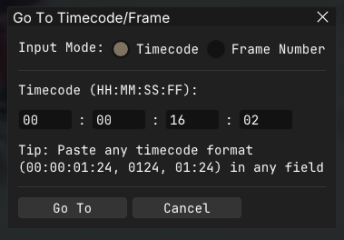

