# Timeline and Transport Controls

## The Controls

The bottom of the **Viewport** panel contains controls for media playback and app state shortcuts. It dynamically shifts based on the loaded media and presents appropriate options. 

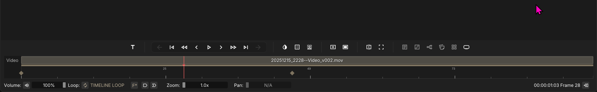

---

## Transport Controls

Media navigation is controlled with these buttons:

* Previous video in playlist (only available in playlist mode)
* Beginning of media
* Rewind (press and hold–it will speed up over time)
* Back one frame
* Play/Pause
* Forward one frame
* Fast Forward (press and hold–it will speed up over time)
* End of media
* Next video in playlist (only available in playlist mode)

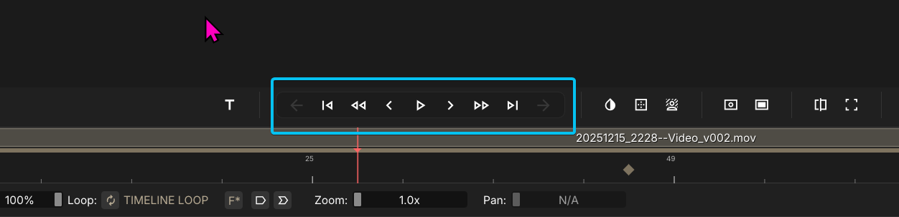

---

## Overlays

These three buttons toggle overlay selectors:

* Colorspace Presets
* Safety Guide Overlays
* Background colors/patterns.

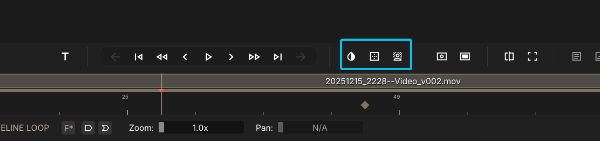

### Color Presets

Color Presets trigger OCIO node trees for commonly accessed color correction flows. Click any to activate the flow, and click `Remove All Color Profiles` to remove any preset applied.

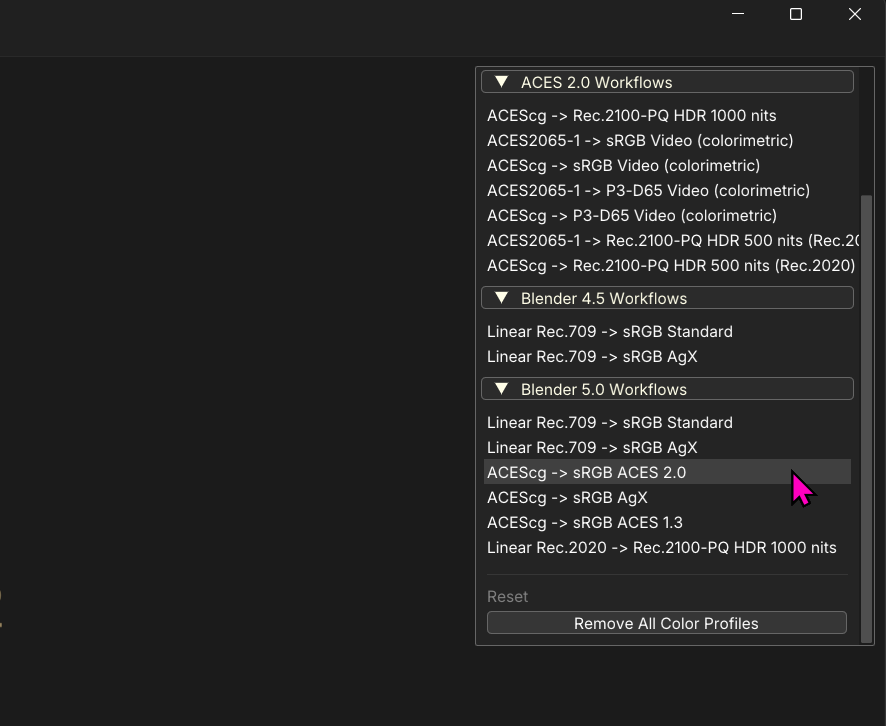

### Safety Overlays

The **Safety Overlays** panel triggers title safety overlays in accordance with common broadcast and social media standards. You can control opacity, line thickness, and color. The app will remember your preferences for these variables. 

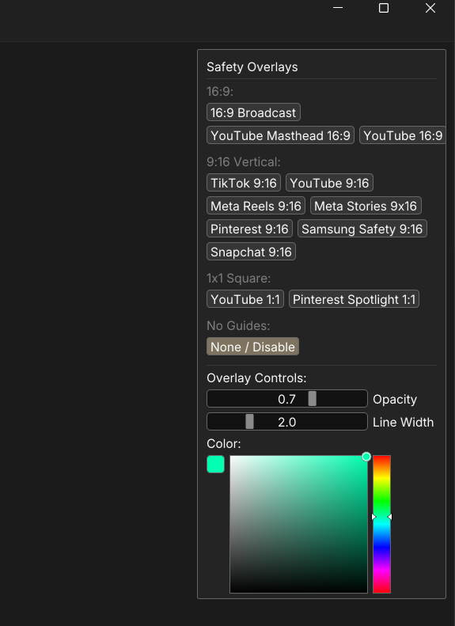

### Background

This panel allows you to change the **Viewer’s** background color and pattern. This background will be presented behind the media, with alpha channels, as well as in the **Viewer's** periphery.

Options are:

* A plain black background
* A default sold grey background
* A dark variation of the mpv-style checkerboard background
* A recreation of the default light-themed mpv checkerboard background

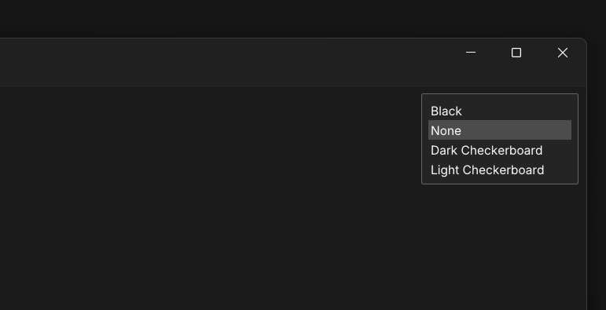

---

## Screenshots

These two buttons allow you to take screenshots of the **Viewer**. The first saves the screenshot to the Windows clipboard so you can paste it into other apps. The second saves a screenshot to your Desktop.

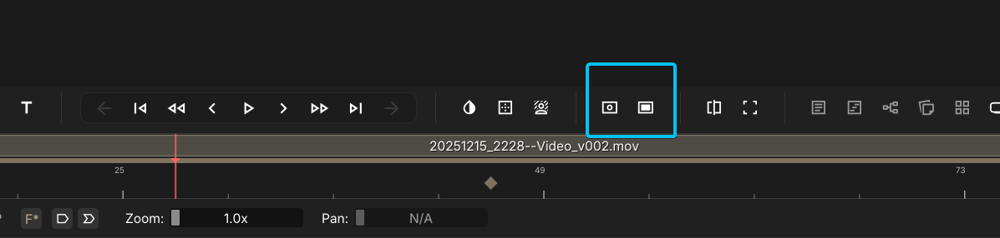

---

## Dual View and Full Screen

The first button launches **Dual View** mode. See the **Dual View** page for more details. The second hides most of the UI and puts the **Viewer** into full screen mode.

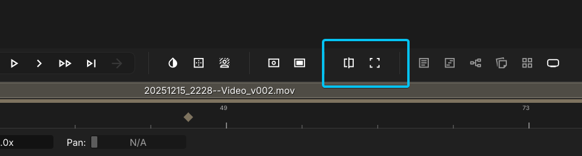

---

## Panel Toggles

The buttons toggle commonly used app panels including:

- The Inspector
- The Project Manager
- The OCIO color panels
- Annotations / Notes
- Miminal mode (just the viewport and timeline)

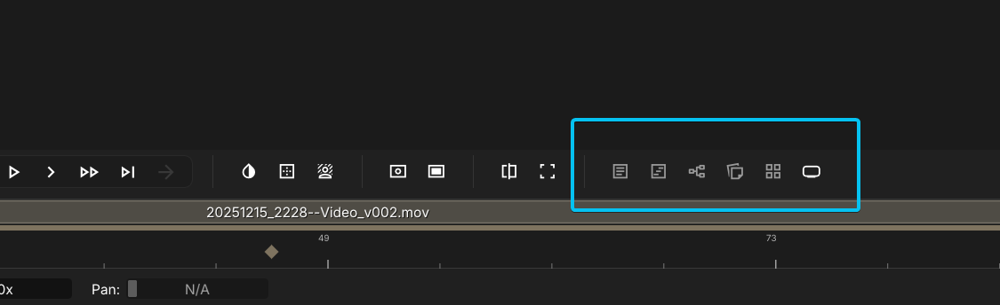

---

## Timecode mode

The Timecode mode button is a toggle state that searches the loaded media for embedded timecode.

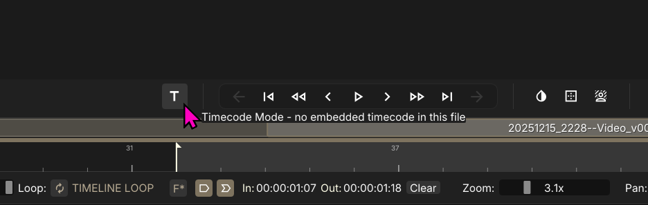

If the loaded media item has embedded timecode, our timecode readout will adjust to display it. 

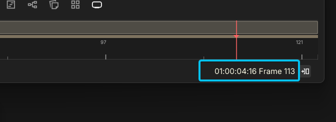

If you click on the button to the right of the timecode and frame counter, you can navigate to a specific timecode or frame in the timeline.

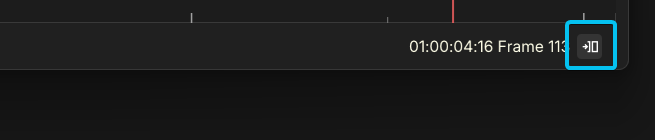

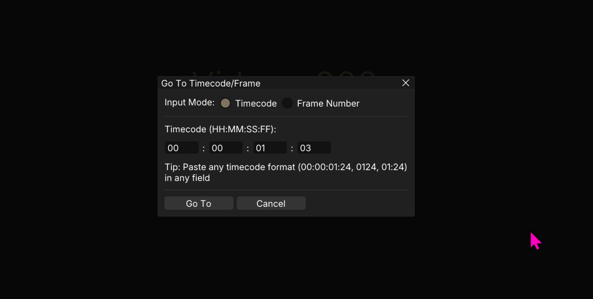

---

## The Timeline

You can zoom into a tighter presentation of this timeline visual by using `Ctrl + Mouse Scroll`. If you `Ctrl + Middle-click` this area, you can pan it. Triggering the `Mouse scroll wheel` without `Ctrl` pans it as well. 

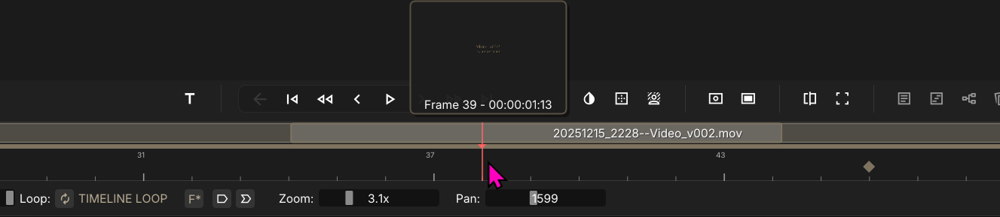

When zoomed in, you may also click on this representation of the zoom zone and drag to pan the timeline.

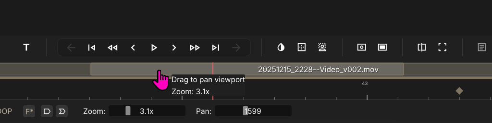

---

## Volume, Mute, Loop, and Follow-Playhead Mode

Sliding the Volume slider adjusts the volume, and clicking the speaker button toggles Mute mode. Clicking the Loop button will trigger a loop mode for single media, playlists, or timelines—-depending on the media loaded. The `F*` button signifies Follow Playhead Mode. When this is toggled, and the timeline is zoomed in, it will auto-pan to keep the playhead in view.

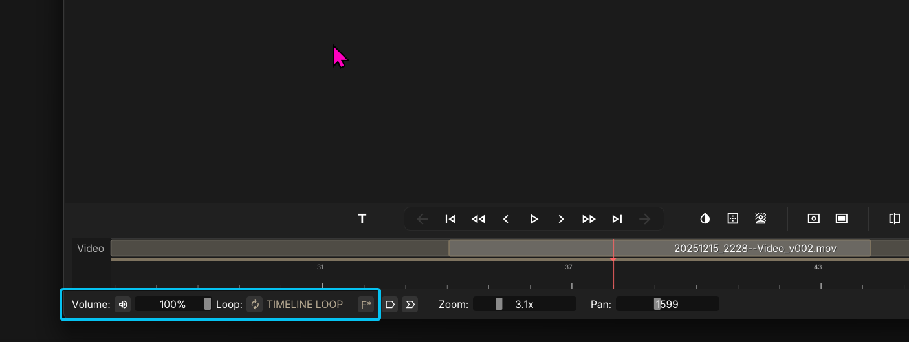

---

## Loop Zones

The keyboard command `I` and `O`, as well as the two buttons in this section, will toggle In and Out points on your timeline. Once an Out point is toggled, a Loop Zone will appear. This visual signifies a set range within which the media will play. Pressing `Clear` releases the Loop Zone and lets you play the entire clip again. 

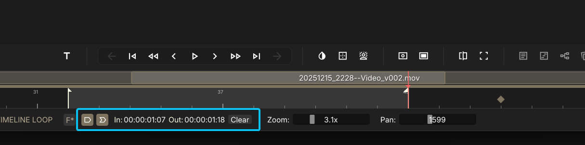

---

## Zoom / Pan

In addition to your middle mouse button, you can use these sliders to zoom and pan a timeline.

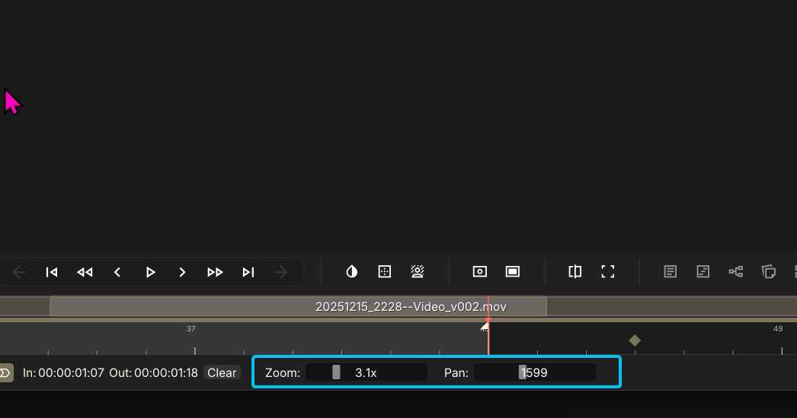 