# Sidebar Controls

## Panel Toggles

The top of the sidebar has buttons to toggle each panel: Project Manager, Inspector, Timeline, Color, and Annotations.

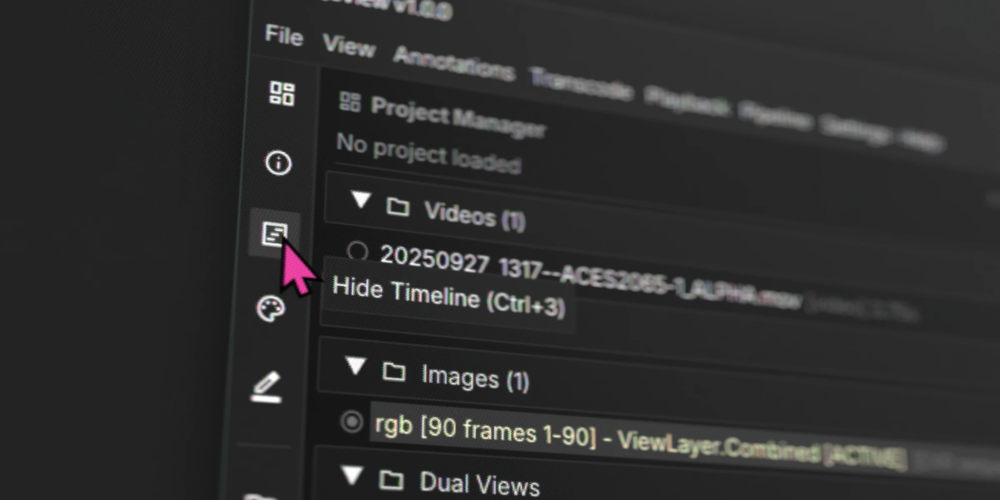

## Open / Save Shortcuts

Below the panel toggles are quick-access buttons for opening media, opening projects, and saving projects.

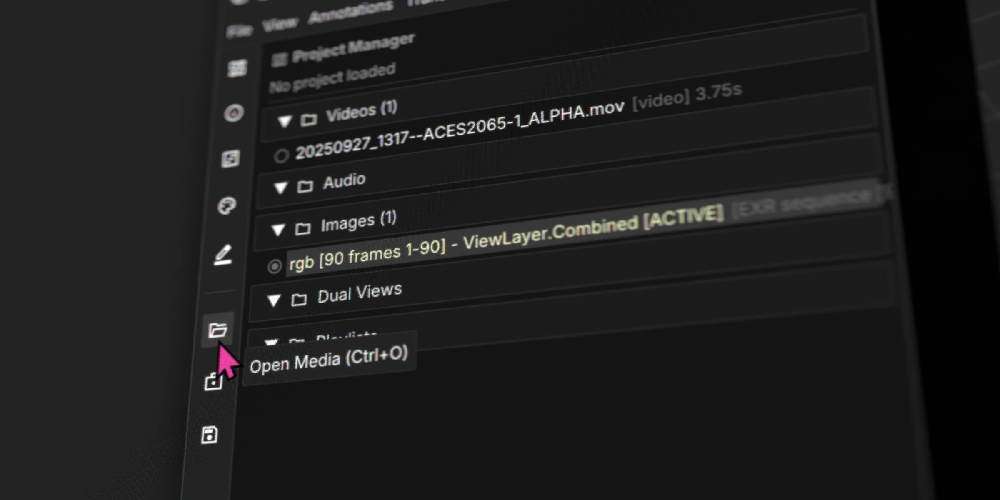

---

# Timeline and Transport Controls

The bottom of the Viewport contains playback controls and app state shortcuts. The layout adapts based on the type of media loaded.

## Transport Controls

| Button | Action |
|---|---|
| Beginning | Jump to start of media |
| Rewind | Press and hold — accelerates over time |
| Back One Frame | Step back one frame |
| Play / Pause | Toggle playback |
| Forward One Frame | Step forward one frame |
| Fast Forward | Press and hold — accelerates over time |
| End | Jump to end of media |

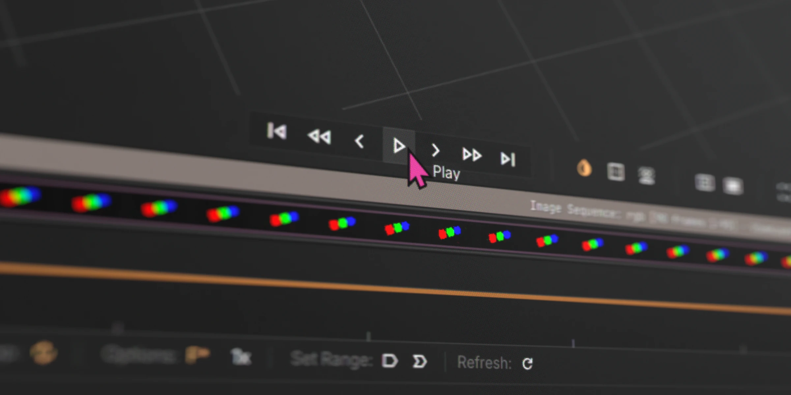

---

## Frame Skipping

When playing back high-resolution image sequences or dense timelines, QCView can skip frames to maintain real-time playback speed. If decoding can't keep up with the target frame rate, the playhead advances at the correct tempo and displays the nearest available frame rather than stalling or slowing down. This keeps audio in sync and gives an accurate sense of timing during review, even when every frame can't be decoded in time.

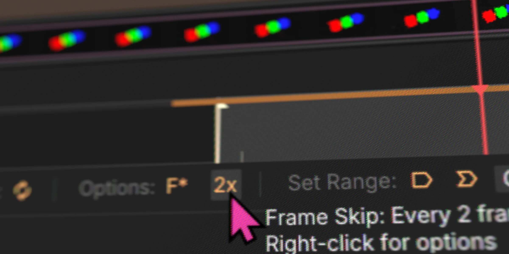

---

## Screenshots

Two screenshot buttons capture the current Viewer contents:

| Button | Action |
|---|---|
| Clipboard | Copies the screenshot to the Windows clipboard for pasting into other apps |
| Desktop | Saves a screenshot file to your Desktop |

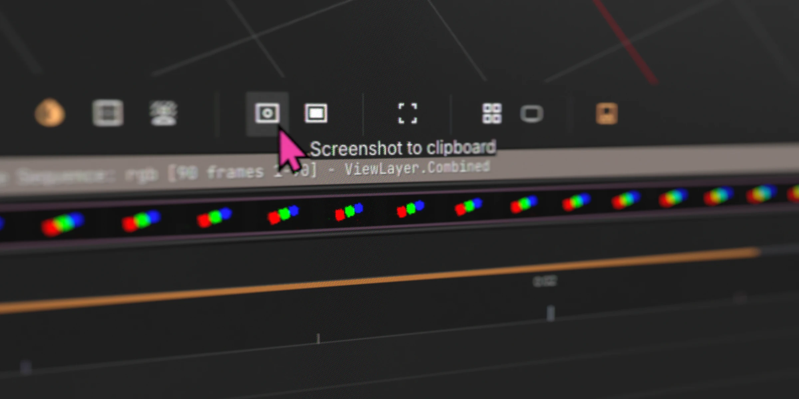

---

## Timecode and Frames

The bottom-right corner displays the current timecode and frame count. Click the seek button next to the counter to jump to a specific time or frame.

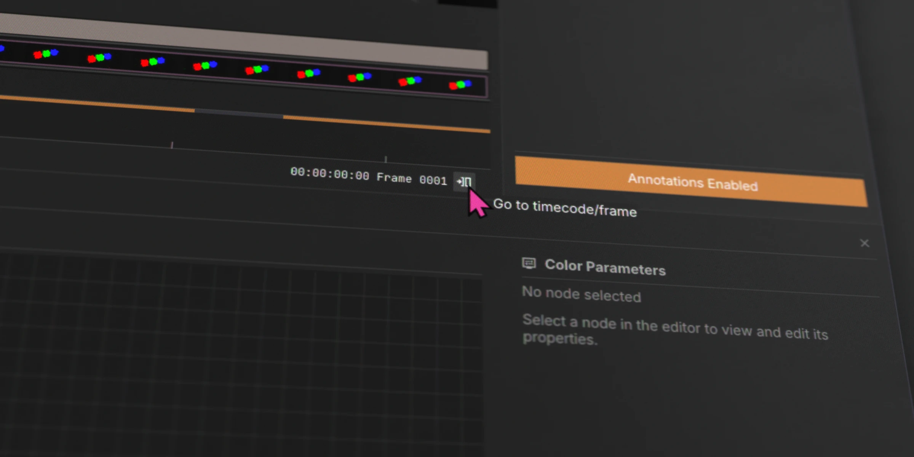

For video files with embedded timecode, a clock icon appears at the far right to switch between file timecode and elapsed time.

---

## Zoom and Pan

Navigate the timeline with these controls:

| Input | Action |
|---|---|
| `Mouse Scroll` | Zoom in/out on the timeline |
| `Ctrl + Mouse Scroll` | Pan the timeline |
| `Middle Mouse Click` + drag | Grab and reposition the timeline |

You can also drag the edges of the zoom region indicator to adjust the visible range.

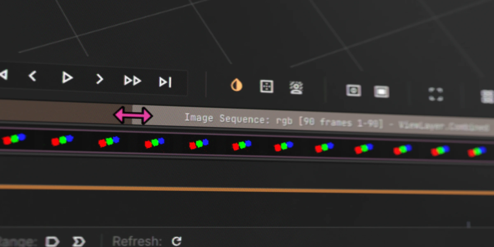

---

## Volume

Adjust the volume slider or click the speaker icon to toggle mute. Located in the bottom-left of the Viewport.

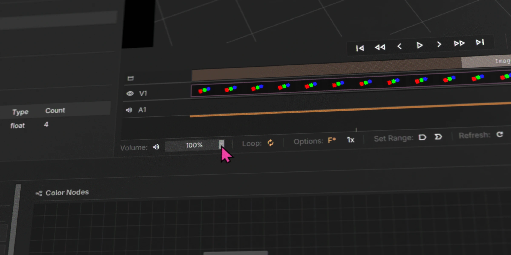

---

## Looping

Loop mode is on by default — media restarts automatically after reaching the end. Disable it to stop at the last frame.

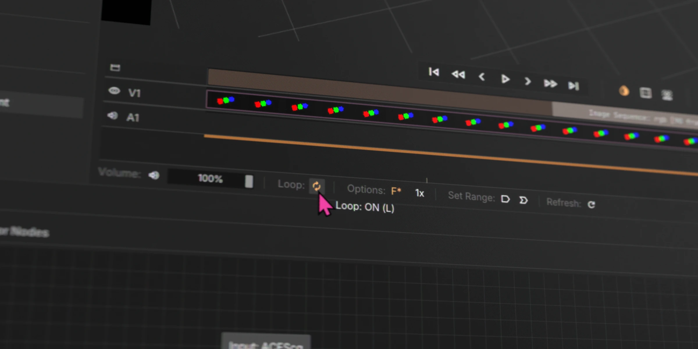

### In/Out Range

Set a loop range with `I` (in point) and `O` (out point), or use the **Set Range** buttons. A highlighted loop zone appears on the timeline showing the active range. Press **Clear** to remove the range and play the full clip.

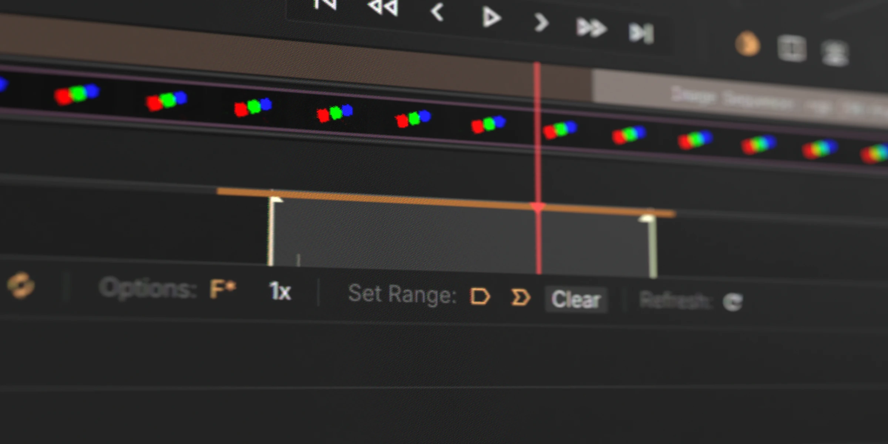

---

## Follow Playhead

When enabled and the timeline is zoomed in, the view automatically scrolls to keep the playhead visible during playback.

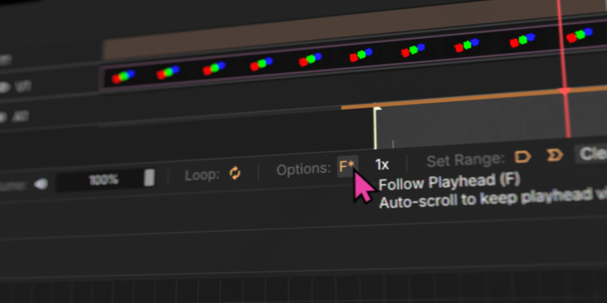

