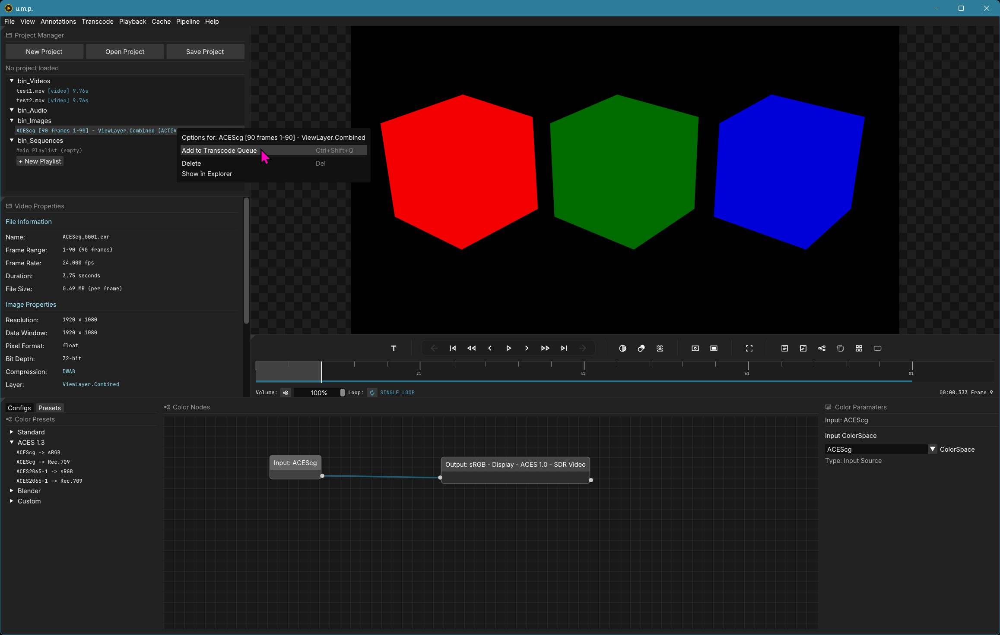
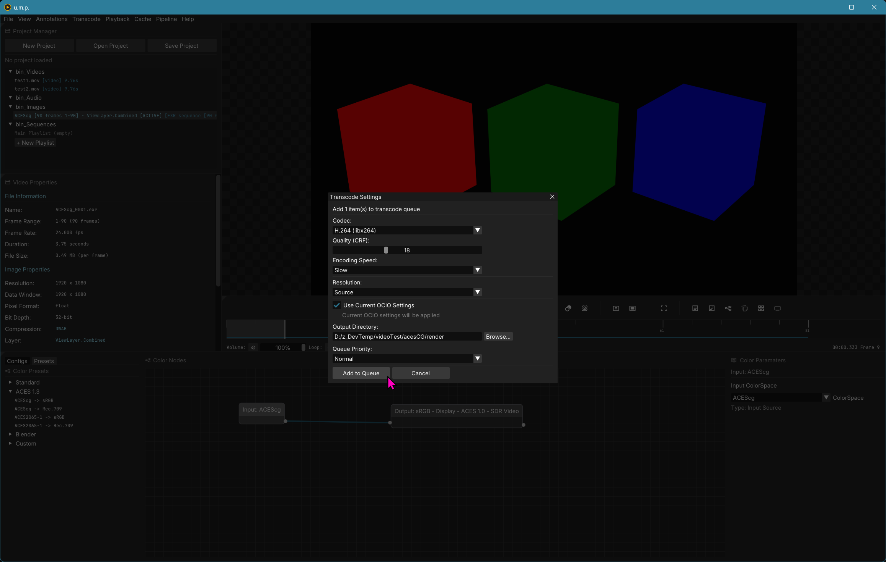
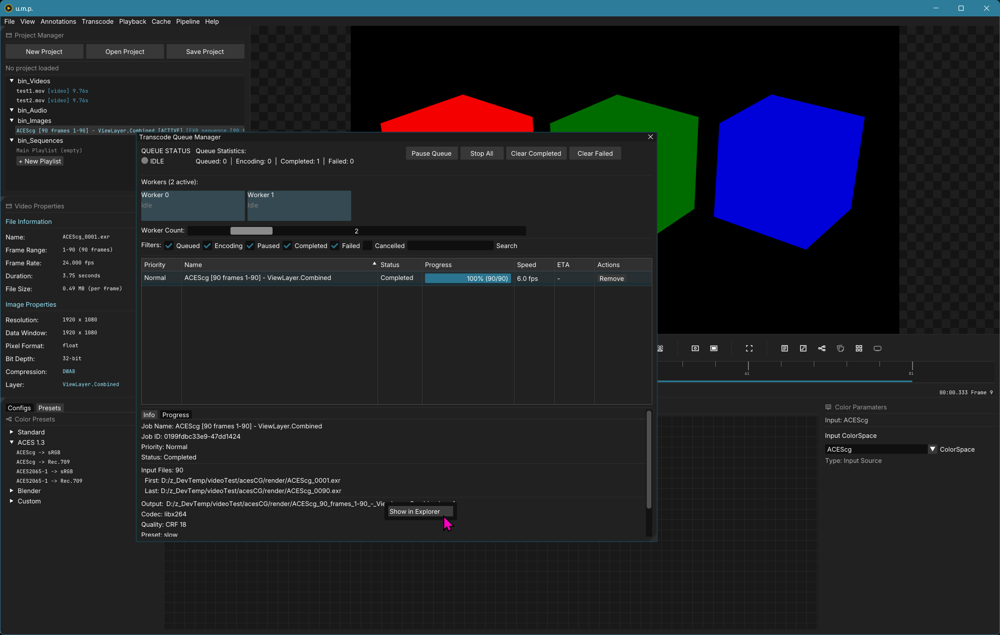

# Transcoding Image Sequences or Videos

## Right click to add to Queue

To add a transcode to the **Queue Manager**, right-click on the file or files and submit.

- You can select different output formats, including H. 264, H. 265, ProRes 422LT, ProRes 422HQ, and ProRes 4444 (4444 will carry over Alpha information).
- Selecting the `Use Current OCIO Settings` option will apply the current color correction flow to the video outputs.

Submitting will add to the **Queue Manager** and automatically begin transcoding.

