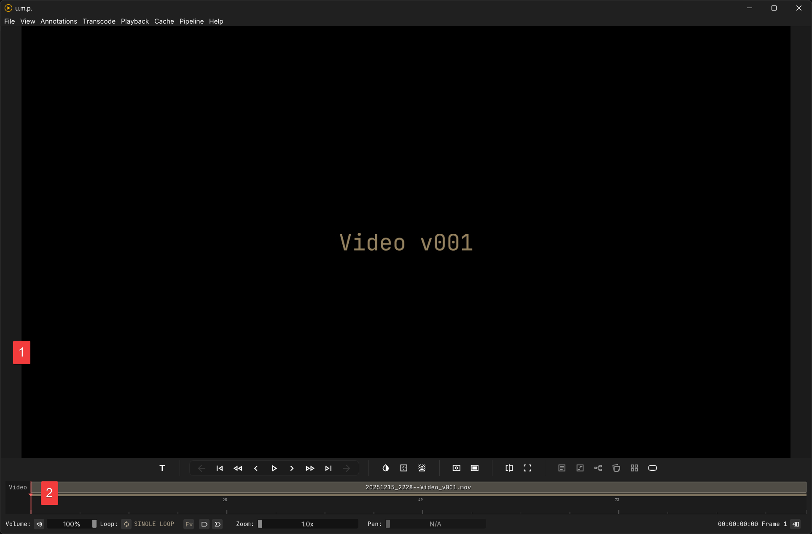
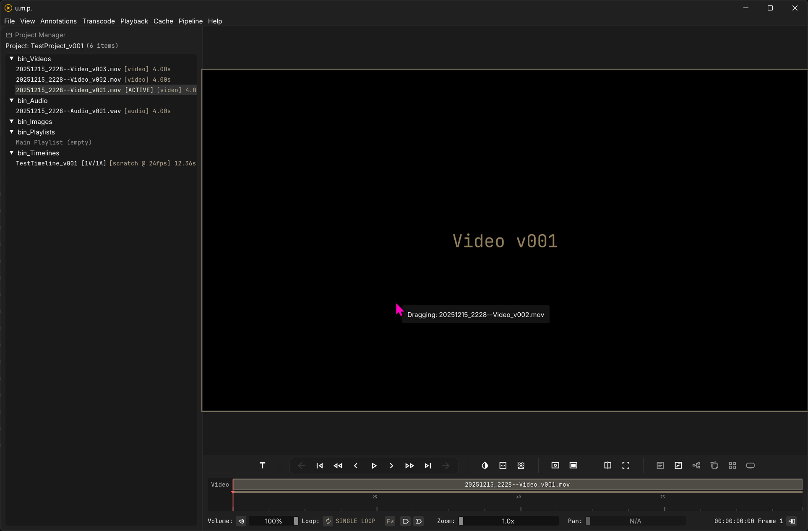

# The Viewport

## The Panels

The Viewport is divided into two sections:

1. The Viewer
2. The Timeline and Transport child window

---

## The Viewer

For the most part, the Viewer is a passive panel for presenting videos and other media, but it’s also a drop zone. You can drag media from the Project Manager into the viewer to load media. The panel’s border will be highlighted with your theme’s accent color if a drop is detected.

---